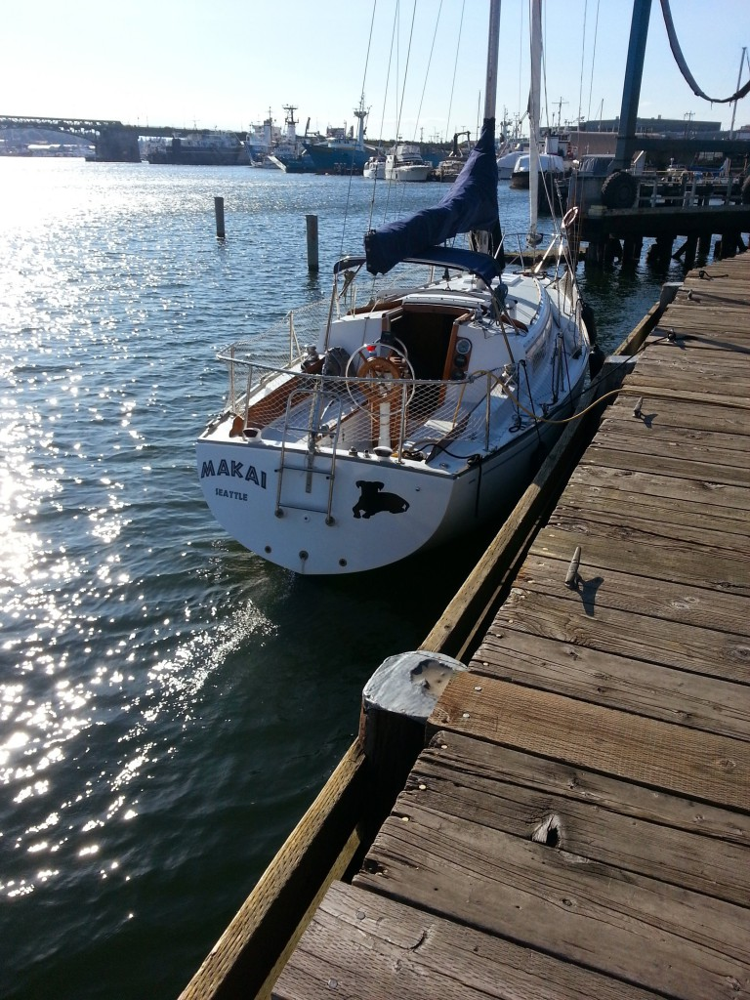

  
  Makai is Hawaiian for "towards the ocean", and that's our goal with her, to get a bit closer to the sea.

  Makai is a 1972 Islander 30 Mk2.  Makai has a long history (including at least one former name) that includes sailing in Washington as well as the bay of San Francisco.  I'll provide more details on the systems Makai has once I have time.

